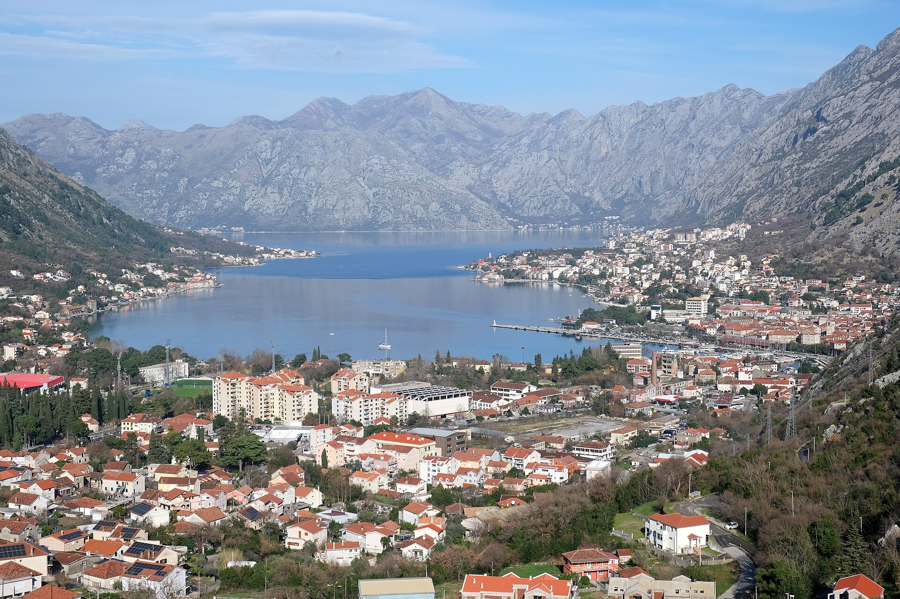
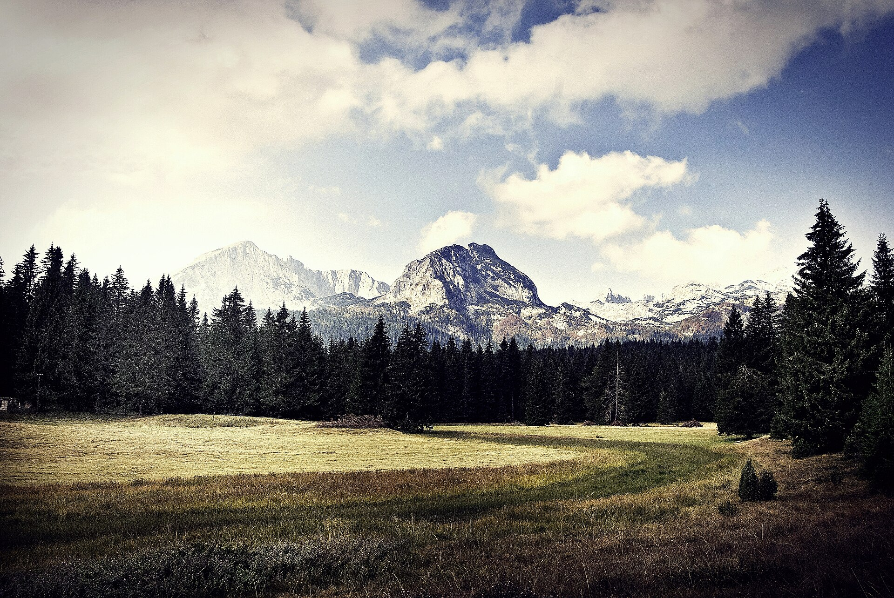

<p align="center">
  <sub>ONE LAST GREATEST HIT · SUPER 8</sub>
</p>

<h1 align="center">
  The Montenegro Tapes
</h1>

<p align="center">
  <em>Не путеводитель. Прощальная кассета.<br>То, что мы ещё не успели соскучиться.</em>
</p>

<p align="center">
  <a href="https://alexander-topilskii.github.io/montenegrotrip/"><strong>▶ PLAY&nbsp;&nbsp;·&nbsp;&nbsp;открыть сайт</strong></a>
</p>

<p align="center">
  5–10 сентября 2026&nbsp;·&nbsp;6 дней&nbsp;·&nbsp;~650 км&nbsp;·&nbsp;4 ночёвки
</p>

<p align="center">
  
</p>

---

> Don't walk away in silence.  
> Шесть дней. Одна кассета. Потом разъедемся.

Интерактивный путеводитель по Черногории в духе подросткового роуд-муви и liner notes к *Mixtape*: карта слушает только текущий день, тексты — как вкладыш кассеты, которую потом нельзя будет перезаписать.

**Живая страница:** [alexander-topilskii.github.io/montenegrotrip](https://alexander-topilskii.github.io/montenegrotrip/)

---

### Side A / Side B

| | День | Сцена |
| :---: | --- | --- |
| **A1** | 5 сентября | Тишина до первой песни — прилёт, машина, Подгорица |
| **A2** | 6 сентября | Вода помнит нас раньше — Котор, лодки, Пераст |
| **A3** | 7 сентября | Fade into you — Ловчен, Негош, на север |
| **B1** | 8 сентября | Озеро, где выключают голоса — Дурмитор, Тара |
| **B2** | 9 сентября | Самый автомобильный день — Седло, кольцо, Пива |
| **B5** | 10 сентября | Не прощай. Просто выключи свет. |

<p align="center">
  
</p>

---

### Локально

```bash
python3 -m http.server 5173
```

Потом [http://localhost:5173](http://localhost:5173) — или `npm start`.

Сайт статический: `index.html`, `css/`, `js/`, `images/`. Деплой на GitHub Pages — из `.github/workflows/pages.yml`, по пушу в `main`.

---

<p align="center">
  <sub>5 сентября, 21:20 — ещё не умели скучать.<br>10 сентября, 21:00 — уже можно ехать в аэропорт.</sub>
</p>

<p align="center">
  <em>Не прощай. Просто выключи свет.</em>
</p>
